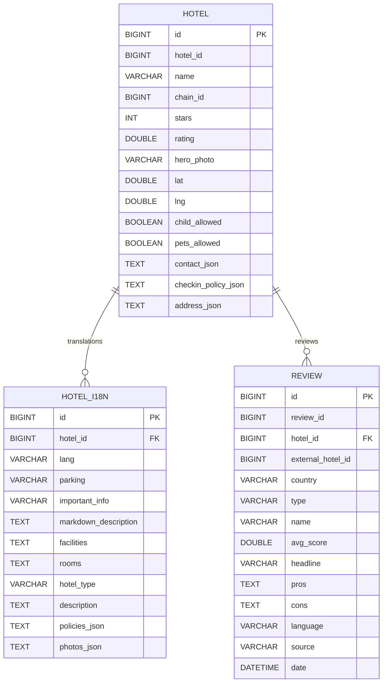

# Database Schema

This document describes the database schema for the Cupid Sync microservice. The schema includes tables for hotels, hotel translations, and reviews. Each table's primary columns and relationships are illustrated below.

## Tables

### `hotel`
Represents a hotel synchronized from the external source.

### `hotel_i18n`
Stores translations and localized information for a hotel. Each row is linked to a hotel and a language.

### `review`
Captures customer reviews associated with a hotel.
